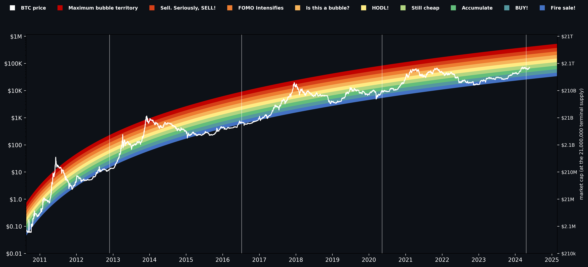
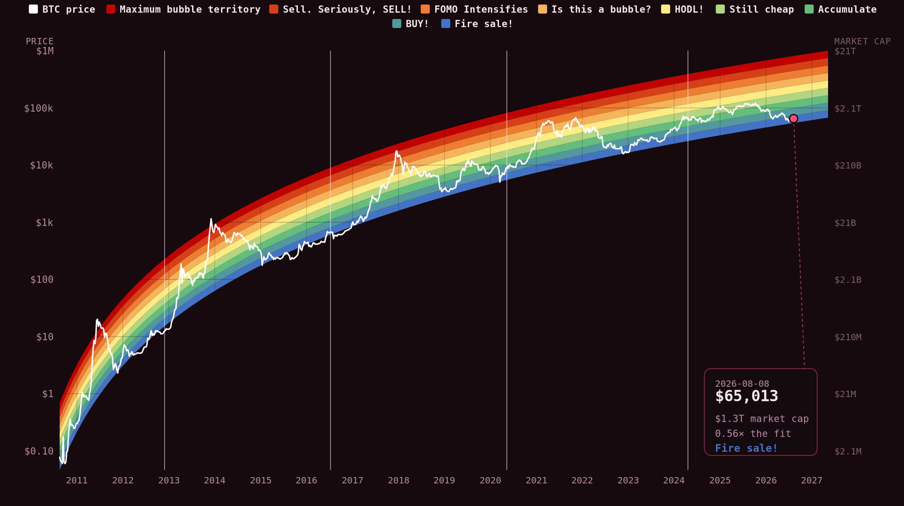

# rainbow-chart

The Bitcoin rainbow chart, in **Python** and in **JavaScript**, drawn as an arc, with a market-cap
axis — and a test that fails if the two implementations ever disagree.



A fork of [StephanAkkerman/bitcoin-rainbow-chart](https://github.com/StephanAkkerman/bitcoin-rainbow-chart),
whose matplotlib renderer, band geometry and colour scale are kept verbatim — the point of a rainbow
chart is that it is the same chart everyone else is looking at.

---

## What is here

| | |
|---|---|
| `src/` | the Python renderer — matplotlib, plus a **market-cap axis** |
| `src/rainbow.py` | the shared core: fit, bands, supply, market cap. **No dependencies, no plotting** |
| `js/rainbow-chart.js` | the browser renderer — SVG, **zero dependencies, zero network calls** |
| `mindx/` | the chart as a [mindX](https://github.com/agenticplace/mindX) `BaseTool` |
| `tests/` | parity: runs both implementations and compares them |
| `docs/` | [explanation](docs/explanation.md) · [technical](docs/technical.md) · [usage](docs/usage.md) |

## Quick start

**Python**

```bash
pip install -r requirements.txt
python src/main.py --save            # img/bitcoin_rainbow_chart.png
python src/main.py --offline --report
```

**JavaScript** — no build step, no bundler, no CDN:

```html
<div data-rainbow-chart data-height="600"></div>
<script src="rainbow-chart.js"></script>
```

The price series is embedded in the file, so `js/example.html` opens from disk and draws with the
network unplugged.



**mindX**

```python
await tool.execute(action="report", price=65013, date="2026-08-08")
# '$65k is 0.56x the fitted curve ($115k) — band 0, "Fire sale!".'
```

## The arc

The fit is a logarithmic regression against **linear time**:

```
ln(price) = a · ln(b + x) + c        a = 5.0222935652
                                     b = 383.8277947247
                                     c = -32.2162634088
                                     R² = 0.9612   n = 5,836   2010-08-16 → 2026-08-08
```

Against a calendar with a log price axis that function *bends* — fast through the early years,
flattening as the logarithm tires. The bend is the arc, and the arc is the chart.

Plot the same fit on log-log axes and it straightens into a diagonal ruler. Both are honest, and the
straight one is better for judging a long extrapolation. But it is not the rainbow chart, and it
spends its canvas badly: on log time, 2010–2011 takes about a fifth of the width while 2020–2026
gets an eighth. The arc spends its width on the years you are actually asking about.

## The bands

Nine bands, each 0.3 wide in natural log, offset so the fit line falls inside band 2. That makes the
ladder **asymmetric** — it reaches **0.472× below** the fit but **7.03× above**, because the chart
was drawn with room for manias.

| band | | × the fit |
|---|---|---|
| 8 | Maximum bubble territory | 5.21 – 7.03 |
| 7 | Sell. Seriously, SELL! | 3.86 – 5.21 |
| 6 | FOMO Intensifies | 2.86 – 3.86 |
| 5 | Is this a bubble? | 2.12 – 2.86 |
| 4 | HODL! | 1.57 – 2.12 |
| 3 | Still cheap | 1.16 – 1.57 |
| 2 | Accumulate | 0.861 – 1.16 |
| 1 | BUY! | 0.638 – 0.861 |
| 0 | Fire sale! | 0.472 – 0.638 |

`bandOf()` returns `-1` / `9` outside the painted range rather than clamping, because about **14% of
BTC's history falls outside it entirely** and pinning to an edge would hide that.

## Market cap

The right margin prices every gridline twice: once as BTC price, once as market cap at the
21,000,000 terminal supply.

| price | market cap |
|---|---|
| $1k | $21B |
| $10k | $210B |
| $100k | $2.1T |
| $1M | $21T |

It is the price axis **rescaled**, not a second measurement — which is why the two never drift apart.
For market cap at a *past* date, where less had been mined, `marketcap_at(price, date)` uses the
supply actually emitted by then, derived from the halving schedule with no network call.

## Parity

Two implementations of the same arithmetic drift apart unless something stops them.

```
$ python tests/test_parity.py
  PASS  test_band_of_anchors
  PASS  test_bands_tile_without_gaps
  PASS  test_day_index_round_trips_across_the_gap
  PASS  test_js_matches_python
  PASS  test_ladder_is_asymmetric_as_documented
  PASS  test_marketcap_axis_is_a_clean_rescale
  PASS  test_supply_schedule_hits_the_textbook_numbers

all green
```

It runs the JavaScript under node and compares fit values, band membership at 64 price/date
combinations, the supply schedule, every constant and every label against the Python core. It has
already earned its keep: it caught the Python side truncating the fractional day in the 1458.33-day
halving step, which had put every scheduled epoch boundary a third of a day early.

## Honest caveats

The bands are **not a model**. They are a regression through past prices plus a colour ramp chosen
by eye. The fit is refitted as data arrives, so the curve quietly moves to keep explaining whatever
just happened. Its R² is high because *any* smooth curve fits sixteen years of log-scaled
exponential growth well. Pushed to 2100 it hands back hundreds of millions per coin — the curve
confessing it describes one era, not the next eleven.

The strategy usually paired with it — rainbow-weighted averaging — reports beating plain DCA 96.8%
of the time in [its CoinMonks write-up](https://medium.com/coinmonks/using-python-to-analyze-rainbow-weighted-averaging-a-more-profitable-frequency-investment-12009a8c3617).
That is a backtest against the same price history the bands were fitted to; a rule that buys more
when price is far below a curve drawn through that price will look good on it mechanically. No
weights are published here for that reason.

Read it as a mood ring, not a price target. Nothing here is financial advice.

## Credits

* [StephanAkkerman/bitcoin-rainbow-chart](https://github.com/StephanAkkerman/bitcoin-rainbow-chart) — the reference implementation
* [CoinGlass](https://www.coinglass.com/pro/i/bitcoin-rainbow-chart) — the colour scale
* /u/pseudoHappyHippy — rainbow-weighted averaging

MIT. See [LICENSE](LICENSE).
